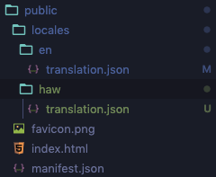
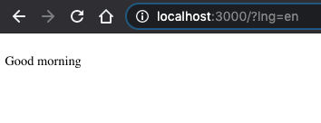
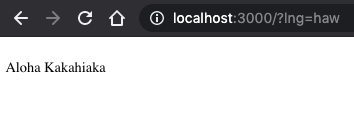

# Grommet and react-i18next quick start guide

#### Resources

[Grommet Starter App](https://github.com/grommet/grommet-starter-new-app "Grommet Starter App")

[react-i18next step by step guide](https://react.i18next.com/latest/using-with-hooks "react-i18next step by step guide")

#### Installation and setup

**Grommet**
Install and set up your grommet app using the **Getting Started**, **Cleaning Up**, and **Adding Grommet** sections of the [Grommet Starter App](https://github.com/grommet/grommet-starter-new-app "Grommet Starter App") guide.

**react-i18next**

Install the react-i18next and i18next packages.

```bash
yarn add react-i18next i18next
```

Install [i18next-xhr-backend](https://github.com/i18next/i18next-xhr-backend "i18next-xhr-backend") to load translations and [i18next-browser-languagedetector](https://github.com/i18next/i18next-browser-languageDetector "i18next-browser-languagedetector") to detect user language.

```bash
yarn add i18next-xhr-backend i18next-browser-languagedetector
```

Create a [configuration file](https://www.i18next.com/overview/configuration-options "configuration file"), i18n.js, in the same folder as your index.js file, and add the following lines of code.

```javascript
import i18n from 'i18next';
import { initReactI18next } from 'react-i18next';

import Backend from 'i18next-xhr-backend';
import LanguageDetector from 'i18next-browser-languagedetector';

i18n
  .use(Backend)
  .use(LanguageDetector)
  .use(initReactI18next)
  .init({
    fallbackLng: 'en',
    debug: true,

    interpolation: {
      escapeValue: false,
    }
  });


export default i18n;
```

Lastly, import the conifg file into the index.js

```javascript
import React from "react";
import ReactDOM from "react-dom";
import App from "./App";
// import here
import "./i18n";

ReactDOM.render(<App />, document.getElementById("root"));
```

#### Translating your first grommet component

**Translation files**
Within the public directory create a folder titled **locales**, and within that create two more titled **en** and **haw**. These two folders will hold the english and hawaiian translation.json files.



In the en translation.json file add these lines of code,
```javascript
{
  "greeting": "Good morning"
}
```
and in the haw translation.json file and these lines of code.
```javascript
{
  "greeting": "Aloha Kakahiaka"
}
```

**useTranslation hook**

In app.js add these lines of code.

```javascript
import React from "react";
import { Box, Grommet, grommet, Paragraph } from "grommet";

const App = () => {
  return (
    <Grommet theme={grommet}>
      <Box>
        <Paragraph>hello</Paragraph>
      </Box>
    </Grommet>
  );
};

export default App
```
To use the [useTranslation](https://react.i18next.com/latest/usetranslation-hook "useTranslation") hook supplied by react-i18next first you will have to import it.

```javascript
import React from "react";
// import here
import { useTranslation } from "react-i18next";
import { Box, Grommet, grommet, Paragraph } from "grommet";

const App = () => {
// The useTranslation hook provides the t function and the i18next instance to the component.
  const { t, i18n } = useTranslation();
  return (
    <Grommet theme={grommet}>
      <Box>
        <Paragraph>hello</Paragraph>
      </Box>
    </Grommet>
  );
};

export default App
```

Next, change the paragraph component to use the t function and the greeting in your translation.json files.

```javascript
// i18next-xhr-backend will look in your locales folder for any translation.json files
<Paragraph>{t('greeting')}</Paragraph>
```

**Suspense**

If you run your project now, you will get an error that looks like this.

```
Error: App suspended while rendering, but no fallback UI was specified.
Add a <Suspense fallback=...> component higher in the tree to provide a loading indicator or placeholder to display.
```

To fix this you will need to use [React Suspense](https://reactjs.org/docs/react-api.html#reactsuspense "React Suspense"). Suspense will provide a loading indicator when your component is ready to render.

First import Suspense, and create a simple loader component.
```javascript
import React, { Suspense } from "react";
```
```javascript
const Loader = () => (
  <Box>
    <Box>loading...</Box>
  </Box>
);
```
Next wrap your component in Suspense.
```javascript
export default () => {
  return (
    <Suspense fallback={<Loader />}>
      <App />
    </Suspense>
  );
};
```

Running your app now should display your enlgish greeting of good morning. To display the hawaiian greeting for good morning append `?lng=haw` to the url, and to return to the enlgish greeting append `?lng=en` to the url or have no querystring at all. i18next-browser-languageDetector can detect the querysting, and display the appropirate language.

`i18next-browser-languageDetector at work`





